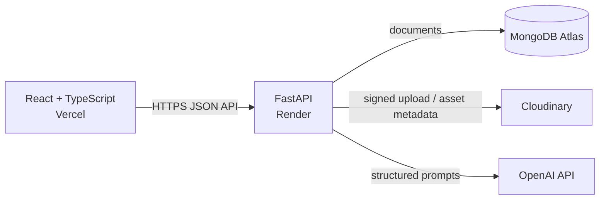

# AI Job Tracker — Architecture and Delivery Plan

## Product intent

AI Job Tracker helps an authenticated job seeker record applications, organize
application materials, monitor progress, and understand their search through
private analytics and AI-assisted drafting.

The first release deliberately focuses on a single user owning their data.
Sharing, teams, and automated job-board ingestion are outside the initial
scope because they introduce different permission and compliance concerns.

## System shape



The browser communicates only with the FastAPI HTTP contract. The backend owns
MongoDB queries and third-party credentials; no database or provider credential
is exposed to the frontend. This allows UI, persistence, storage, and AI
providers to change independently.

## Repository layout

```text
ai-job-tracker/
├── docs/                         # Architecture decisions and operating notes
├── frontend/                     # Independently deployable React application
│   └── src/
│       ├── app/                  # Routing, providers, and application composition
│       ├── features/             # Feature-specific UI, hooks, and API clients
│       ├── components/           # Reusable presentational components
│       ├── lib/                  # Framework-neutral client utilities
│       └── types/                # Shared client-side TypeScript contracts
└── backend/                      # Independently deployable FastAPI application
    └── app/
        ├── api/                  # HTTP routes and request/response schemas
        ├── application/          # Use cases; orchestration only
        ├── domain/               # Business entities, rules, and interfaces
        ├── infrastructure/       # MongoDB, JWT, Cloudinary, OpenAI adapters
        └── core/                 # Settings, security primitives, error handling
```

`features` prevents page-level components from becoming large mixed concerns.
Backend layers ensure routes are not tied to MongoDB or external providers:
the domain states the required behavior, application use cases coordinate it,
and infrastructure fulfills it. Cross-layer dependencies point inward.

## Core domains

| Domain | Responsibility | Ownership boundary |
| --- | --- | --- |
| Identity | Registration, login, token issuance, account profile | A user owns their account |
| Applications | Job application lifecycle and timeline | A user owns every application |
| Materials | Résumés, cover letters, and uploaded files | A user owns every material |
| Insights | Aggregate, read-only application metrics | Derived only from that user's applications |
| AI assistance | Drafting and tailored suggestions | Uses a user's supplied application/material context |

## MongoDB collections

### `users`

Stores one account per email. Required fields: `_id`, `email` (unique,
normalized), `password_hash`, `display_name`, `created_at`, `updated_at`.
Optional fields: `avatar_url`, `last_login_at`.

Indexes: unique `{ email: 1 }` and `{ created_at: -1 }` for operational
administration. Passwords are never stored or logged in clear text.

### `job_applications`

Stores the current state of a role being pursued. Required fields: `_id`,
`user_id`, `company_name`, `job_title`, `status`, `applied_at`, `created_at`,
`updated_at`. Optional fields include `job_url`, `location`, `workplace_type`,
`salary`, `job_description`, `notes`, `next_action_at`, `archived_at`.

`status` is a controlled enum: `saved`, `applied`, `screening`, `interviewing`,
`offer`, `rejected`, `withdrawn`. Store `user_id` as an ObjectId rather than
embedding applications in `users`, so applications can be queried, paginated,
and indexed independently.

Indexes: `{ user_id: 1, updated_at: -1 }`, `{ user_id: 1, status: 1 }`, and
`{ user_id: 1, next_action_at: 1 }`.

### `application_events`

An immutable timeline for meaningful lifecycle actions. Required fields:
`_id`, `user_id`, `application_id`, `event_type`, `occurred_at`, `created_at`.
Optional `metadata` is a constrained, event-type-specific object.

This separate collection preserves auditability and avoids unbounded arrays in
an application document. Application and user ownership are duplicated for
efficient authorization filtering; both must match before an event is read.

Indexes: `{ application_id: 1, occurred_at: -1 }` and
`{ user_id: 1, occurred_at: -1 }`.

### `materials`

Records application materials and asset references. Required fields: `_id`,
`user_id`, `kind` (`resume`, `cover_letter`, `portfolio`, `other`), `name`,
`created_at`, `updated_at`. File-backed materials add `asset_provider`,
`asset_public_id`, `asset_url`, `mime_type`, and `bytes`. Text-backed materials
add `content` and an optional `source_application_id`.

Cloudinary is the blob store; MongoDB stores only provider metadata and
business-level relationships. Index `{ user_id: 1, kind: 1, updated_at: -1 }`.

### `ai_generations`

Stores a minimal audit trail for user-requested AI output: `_id`, `user_id`,
`purpose`, `input_fingerprint`, `output`, `model`, `created_at`. It does not
store API secrets and will redact or avoid sensitive personal content where
possible. Retention policy and a user deletion pathway are required before
launch.

Index `{ user_id: 1, created_at: -1 }`.

## API conventions

- Versioned routes begin with `/api/v1`.
- JSON payloads use `snake_case`; frontend mappers convert only if UI naming
  needs it. The typed API client is the single conversion boundary.
- FastAPI/Pydantic schemas validate all incoming requests and define all
  responses. MongoDB documents never leave route handlers directly.
- Authenticated resource queries always filter by the JWT subject (`user_id`);
  a path identifier alone never grants access.
- Errors use `{ "error": { "code", "message", "details?" } }` with stable
  codes. Validation errors are normalized to this shape.
- List endpoints support bounded `limit`, opaque cursor pagination, and
  allow-listed filters and sorts.

## Security baseline

- Passwords use Argon2id via `pwdlib`; passwords are never reversible.
- JWT access tokens are short-lived and signed with an environment-provided
  secret. Refresh-token rotation will be introduced with the authenticated
  session feature if persistent sessions are required.
- CORS permits only configured frontend origins. Production credentials,
  MongoDB URI, OpenAI key, Cloudinary secret, and JWT secret live exclusively
  in deployment environment variables.
- Login and registration are rate-limited by IP and normalized email. Generic
  authentication failures prevent account enumeration.
- File uploads use an allow-list of MIME types, byte limits, server-generated
  Cloudinary public IDs, and authorization checks before any asset operation.
- AI requests are authenticated, size-limited, logged without secrets, and
  never allowed to execute instructions from uploaded content.

## Feature roadmap

1. **Authentication foundation** — register, sign in, sign out, protected app
   shell, and current-user endpoint.
2. **Application management** — create, list, inspect, edit, archive, and
   transition job applications with a timeline.
3. **Search workflow** — filters, sorting, pagination, reminders, and a
   focused application board.
4. **Materials and uploads** — Cloudinary-backed résumé and supporting-file
   management, linked safely to applications.
5. **AI assistance** — tailor résumé bullets, draft cover letters, and suggest
   next actions with explicit user review before persistence.
6. **Analytics dashboard** — stage funnel, activity trend, and response-rate
   metrics calculated from user-owned data and rendered with Recharts.
7. **Production readiness** — observability, integration tests, CI, deployment
   configuration, data lifecycle controls, and accessibility review.

## Feature 1 preview: Authentication foundation

### Goal

Give a job seeker a secure account and establish an authenticated application
shell used by all later features.

### User flow

1. Visitor opens the application and chooses registration or sign-in.
2. Registration validates details, creates an account, and establishes a
   session.
3. Returning user signs in and is routed to the protected dashboard shell.
4. An expired or invalid token returns the user to sign-in without exposing
   protected data.

### UI structure

- `AuthLayout`: centered, accessible layout shared by sign-in and registration.
- `SignInForm` and `RegisterForm`: reusable field and submission behavior but
  distinct validation rules and intent.
- `TextField`, `PasswordField`, `FormError`, and `SubmitButton`: general UI
  components, kept out of the auth feature because future forms also need them.
- `ProtectedRoute`: verifies session state before rendering feature routes.

### API endpoints

| Method | Path | Purpose |
| --- | --- | --- |
| POST | `/api/v1/auth/register` | Create an account and issue an access token |
| POST | `/api/v1/auth/login` | Verify credentials and issue an access token |
| GET | `/api/v1/auth/me` | Return the authenticated user's safe profile |

### Validation and edge cases

- Email is normalized, RFC-shaped, and unique case-insensitively.
- Display name is trimmed and length-bounded.
- Password requires a meaningful minimum length and maximum size.
- Duplicate registration returns `409 email_already_registered`.
- Invalid credentials return one generic `401 invalid_credentials` response.
- Missing, expired, malformed, or user-less tokens return `401`.
- A deactivated account (future-ready field) cannot obtain a session.

### Testing checklist

- Unit-test password and token services independently.
- Test request validation and error normalization at each route.
- Test duplicate emails, invalid credentials, expired tokens, and protected
  route redirects.
- Add frontend tests for form errors, pending submission state, and successful
  navigation.
- Verify keyboard navigation, labels, focus management, and small-screen layout.

## Open decisions before implementation

- Use Vite for the React build and React Router for client navigation unless a
  different existing frontend constraint is introduced.
- Begin with a short-lived access token in memory; choose an HttpOnly refresh
  cookie/session model during Feature 1 based on deployment domain setup.
- Use OpenAI's current recommended API/model when Feature 5 begins, rather than
  hard-coding a potentially stale model choice now.
